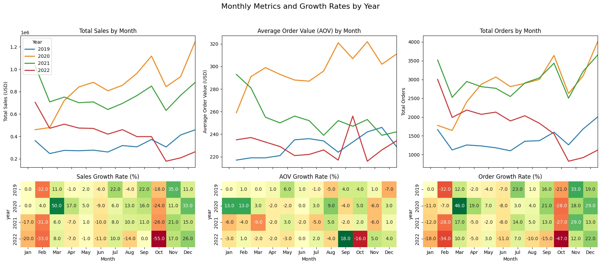

# Post-Pandemic Sales Analysis for TechHub

## Project Overview

**Project Title**: Post-Pandemic Sales Analysis for TechHub  
**Duration**: January 2024 – Present  
**Role**: Data Analyst Intern  
**Tools Used**: Python, SQL, Tableau, Power BI, Excel  
**Collaborator**: Head of Operations

---

### **Company Overview**
TechHub is a leading global electronics e-commerce platform, specializing in high-demand consumer electronics such as laptops, smartphones, and gaming accessories. Founded in 2017, TechHub has built a strong presence in North America, EMEA, and APAC markets. Despite the challenges presented by the COVID-19 pandemic, TechHub has continued to grow its brand and customer base, aiming to provide customers with the latest in electronics at competitive prices.

---

## **Executive Summary**

TechHub has experienced steady growth in sales between 2019 and 2022, with annual revenues consistently above $8 million. Post-pandemic, however, sales dropped by 40% in 2022 before stabilizing. The analysis of this dataset, comprising over 100,000 records, highlights critical trends in sales, customer retention, and product performance. TechHub’s top products include laptops, smartphones, and gaming accessories, which represent the majority of sales.

Key insights show a consistent decline in customer retention, particularly in repeat purchase rates. Recommendations for improving sales include enhancing product bundles, focusing on high-performing items, and re-engaging lapsed customers through loyalty programs and targeted marketing.

---

## **Data Overview**

The analysis is based on a dataset with over 108,000 records of transactions from 2019 to 2022. The dataset includes detailed information about customer demographics, product categories, sales performance, and marketing channel effectiveness. An Entity-Relationship Diagram (ERD) has been designed to visualize the data relationships and support insights.

---

### **Key Insights**

#### **Sales Trends and Growth Rates**
- TechHub averaged $8 million in annual sales, with 30,000 orders per year.
- Sales were significantly boosted in 2020 due to pandemic-induced buying patterns, but revenue declined by 40% in 2022.
- Seasonal spikes in November and December, with lower sales periods in February and October, reflect typical industry trends.
- North America and EMEA contribute 80% of total sales, with North America leading at 50%.
- APAC and LATAM showed rapid growth in 2020 but have become volatile since, necessitating further focus on stabilization.

  
  

#### **Product Performance**
- The top products are laptops, smartphones, and gaming accessories, accounting for 92% of total sales.
- Laptops generated $10.5M in revenue, while smartphones contributed $6.2M.
- The gaming accessories category underperforms, accounting for only 5% of total revenue but 20% of all orders, suggesting opportunities for improvement in product bundling.

   

#### **Customer Growth and Retention**
- The number of unique customers grew until 2021 but dropped sharply by 35% in 2022.
- Repeat purchases decreased from 18% in 2019 to 12% in 2022, signaling challenges in retaining customers.
- High-value, loyal customers continue to contribute significantly, but their numbers have declined over time.

    

#### **Loyalty Program Insights**
- Loyalty program members make purchases 25% earlier than non-members, indicating a stronger relationship with the brand.
- Loyalty members generate 15% more revenue and 20% more orders than non-members, but membership growth slowed in 2022.
- Refund rates for loyalty members are higher compared to non-members, suggesting a need for closer analysis of product quality or customer expectations.

  
  

#### **Sales by Channels and Platforms**
- Direct sales through TechHub’s website account for 85% of total sales, while affiliate and social media marketing channels contribute only 4% and 2%, respectively.
- The mobile app’s contribution to overall sales is relatively low, with an average order value (AOV) of $55, compared to $320 for the website.

  

#### **Refund Rate Trends**
- Refund rates were highest for smartphones and gaming accessories, particularly in 2020. This trend has since stabilized, but refunds still account for around 5% of total sales.
- Laptops, while expensive, had a lower refund rate, with returns decreasing over the years.

    
---

## **Recommendations**

### **Maximizing Product Offerings**
- **Expand High-Performing Categories**: Focus on increasing product offerings for laptops and smartphones with new models and premium variants.
- **Improve Gaming Accessories Sales**: Bundle gaming accessories with top-selling products like smartphones and laptops to boost their sales potential.

### **Customer Growth and Retention**
- **Increase Repeat Purchases**: Re-engage customers through personalized promotions, targeted email campaigns, and special discounts for repeat purchases.
- **Customer Acquisition**: Leverage social media and affiliate programs more effectively to drive new customer acquisition, especially in emerging markets like LATAM and APAC.
- **Refine Loyalty Programs**: Revamp the loyalty program to increase membership and engagement, ensuring that the benefits are clear and attractive.

### **Loyalty Program Enhancements**
- **Improve Loyalty Member Experience**: Offer exclusive promotions, sneak peeks at new products, and early access to sales to drive further engagement.
- **Address Refund Trends**: Investigate the higher refund rates among loyalty members and identify the underlying causes, such as product issues or mismatches between expectations and reality.

### **Refund Management**
- **Monitor and Address Refund Rates**: Continue to track and minimize refund rates by improving product quality, offering better customer support, and providing more accurate product descriptions.

### **Platform Optimization**
- **Focus on Website Sales**: Continue to optimize the website to enhance the shopping experience, with faster checkout processes and personalized product recommendations.
- **Mobile App Enhancements**: Improve the mobile app’s functionality, speed, and user experience to encourage higher conversion rates and AOV from mobile users.

---

## **Clarifying Questions, Assumptions**

### **Unmatched Customer Records**
- A portion of transactions (~20K) has missing `customer_id` records, which may affect the accuracy of customer-based analysis and require further data cleansing.

### **Loyalty Program Clarification**
- The definition of loyalty membership and its benefits across different channels (website, mobile app) needs clarification. This will help refine the analysis and improve recommendations.

### **Channel Attribution**
- The attribution model for channels does not account for multi-touch attribution. This could skew the effectiveness analysis of different marketing channels.

---

## **Future Work and Considerations**
1. **Data Cleansing**: Address unmatched customer records and missing data to improve the reliability of future analyses.
2. **Customer Segmentation**: Perform advanced customer segmentation to target high-value customers more effectively and increase loyalty program participation.
3. **Cross-Channel Attribution**: Refine the channel attribution model to better understand the contribution of each channel to customer acquisition and retention.

---

## **Contact Information**
- **Author**: Aryan Alpesh Agarwal  
- **Email**: aryanagarwal1227@gmail.com  
- **LinkedIn**: [LinkedIn Profile](https://www.linkedin.com/in/aryan1227/)  
- **GitHub**: [GitHub Profile](https://github.com/AryanAgarwal27)

---

## License
This project is licensed under the MIT License - see the [LICENSE](LICENSE.txt) file for details.

